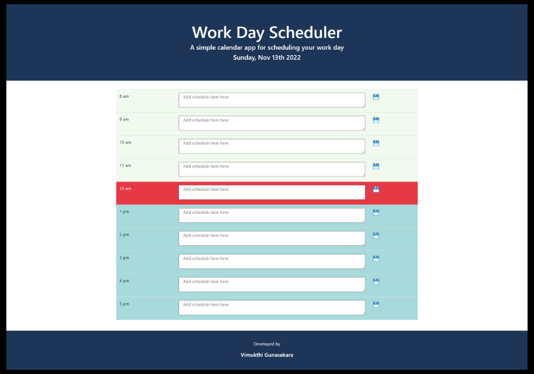

# Work Day Scheduler 📅

The Work Day Scheduler is a tool that helps you keep track of your daily schedule and easy-to-use tool that helps you plan your work days.

<p>
    
    
    
    
    
</p>

## Submission

Deployed URL: https://vimukthigunasekara.github.io/work-day-scheduler/
<br>
GitHub Repo URL: https://github.com/VimukthiGunasekara/work-day-scheduler
 
 
## User Story

``` 
AS AN employee with a busy schedule
I WANT to add important events to a daily planner
SO THAT I can manage my time effectively
```


## Acceptance Criteria

```
GIVEN I am using a daily planner to create a schedule
WHEN I open the planner
THEN the current day is displayed at the top of the calendar
WHEN I scroll down
THEN I am presented with timeblocks for standard business hours
WHEN I view the timeblocks for that day
THEN each timeblock is color coded to indicate whether it is in the past, present, or future
WHEN I click into a timeblock
THEN I can enter an event
WHEN I click the save button for that timeblock
THEN the text for that event is saved in local storage
WHEN I refresh the page
THEN the saved events persist
```


## License

released under MIT license.


## Mock-Up


